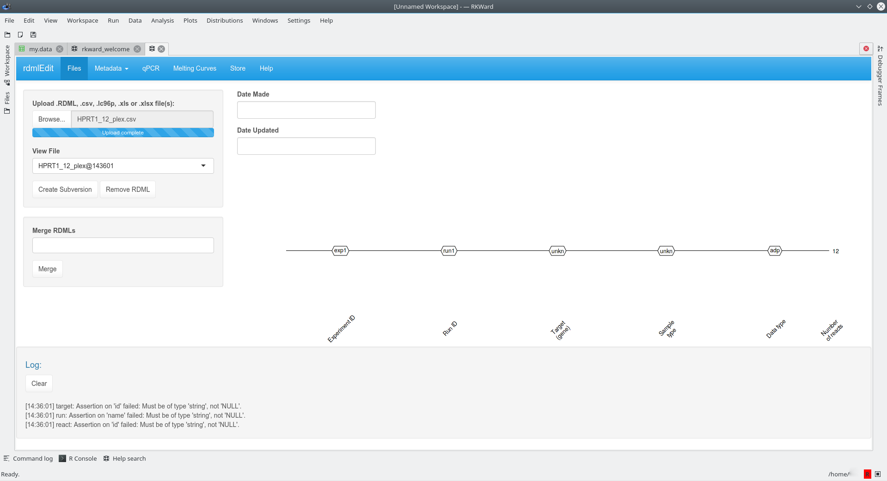
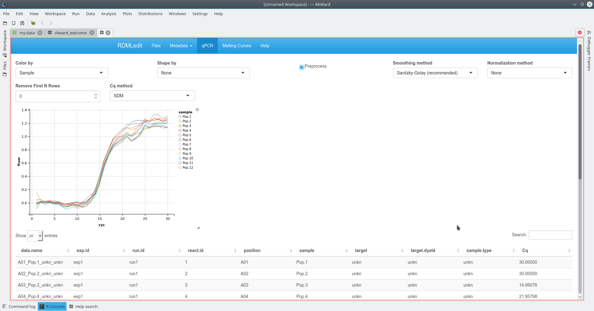
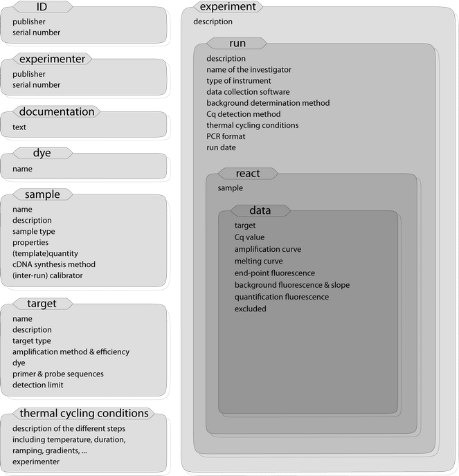

```{r, echo = FALSE, message = FALSE}
knitr::opts_chunk$set(collapse = TRUE, comment = "#>")
library(kfigr)
library(RDML)
```

# Introduction to the RDML package

The [RDML](https://CRAN.R-project.org/package=RDML) package was created to work with the Real-time PCR Data Markup Language (RDML) -- a structured and universal data standard for exchanging quantitative PCR (qPCR) data [@lefever_rdml_2009; @rdml-ninja_2015]. RDML belongs to the family of eXtensible Markup Languages (XML). It contains fluorescence data and information about the qPCR experiment. A description and the RDML schema and the RDML format are available at http://rdml.org.

The XML technology is commonly used in the **R** environment and there are several tools to manipulate XML files [@xml_book]. When working with XML data, the workhorse package is **XML** [@Lang_XML].Therefore, investments development, implementation and maintenance is moderate.

We use the **R6** [@Chang_R6], **assertthat** [@Wickham_assertthat], **plyr** [@Wickham_plyr], **dplyr** [@Wickham_Francois_dplyr], **tidyr** [@Wickham_tidyr] and **rlist** [@Ren_rlist] packages.

## Philosphy of the RDML package
`RDML` imports various data formats (CSV, XMLX) besides the RDML format. Provided that the raw data 
have a defined structure (as described in the vignette) the import should be 
done by a few clicks. The example below shows the import of amplification curve
data, which were stored in a CSV file. The function `rdmlEdit()` was used in the 
[RKWard IDE/GUI](https://rkward.kde.org/) [@roediger_rkward_2012] (tested with version 0.6.9z+0.7.0+devel1 on Kubuntu 17.04; NOTE: problems were reported on systems where not the webkit component was used for the rendering of the `rdmlEdit()` GUI) for further processing.



Once imported enables `rdmlEDIT()` and other functions from the `RDML` package complex 
data visualization and processing in the R statistical computing environment.



## Major functionalities of the RDML package

The public methods of the main R6 “RDML” class can be used 
to access and process the internally stored RDML data. These methods include:

* **new()** -- creates a new RDML object, empty or from a specified RDML file;
* **AsDendrogram()** -- plots the structure of an RDML object as a dendrogram;
* **AsTable()** -- represents the data contained in an RDML object (except fluorescence data) as a *data.frame*;
* **GetFData()** -- gets fluorescence data;
* **SetFData()** -- sets fluorescence data to an RDML object; 
* **AsXML()** – saves an RDML object as an RDML~v.~1.2 file.

# Vendors and software packages supporting RDML

The RDML format is supported by Bio-Rad (CFX 96 and CFX 384), Life Technologies (StepOne, ViiA7, QuantStudio) and Roche (LightCycler~96) thermo-cycler systems. In addition, several software packages (e.g., **Primer3Plus**, **RDML-Ninja**, **qBase+**) exist, which support RDML [@untergasser_2007; @hellemans_2007; @ruijter_amplification_2009; @pabinger_2014; @rdml-ninja_2015].

# Structure of the **RDML** package

The structure of the **RDML** package mimics the RDML format and provides several [R6](https://CRAN.R-project.org/package=R6/vignettes/Introduction.html) classes, which corresponds to [RDML v1.2](http://rdml.org/files.php?v=1.2) format types. All major manipulations with RDML data can be done by a class called **RDML** through its public methods:

- `$new()` -- creates new **RDML** object (empty or from specified RDML file) 
- `$AsTable()` -- represents data contained in **RDML** object (except fluorescent data) as data.frame.
- `$GetFData()` -- gets fluorescent data.
- `$SetFData()` -- sets fluorescent data to **RDML** object.
- `$AsDendrogram()` -- represents structure of **RDML** object as dendrogram.

## Opening and observing RDML file

In this section we will use the built-in RDML example file `lc96_bACTXY.rdml`. This file was obtained during the measurement of human DNA concentration by a *LightCycler 96* (Roche) and the *XY-Detect* kit (Syntol, Russia).

To open the `lc96_bACTXY.rdml` file we have to create a new **RDML** object with its class initializer -- `$new()` and the file name as parameter `filename`. 
```{r, results = "hide"}
filename <- system.file("extdata/lc96_bACTXY.rdml", package = "RDML")
lc96 <- RDML$new(filename = filename)
``` 
Next we can check structure of our new object -- `lc96` by printing it.
```{r}
lc96
```
As a result we can see field names and after `:` :

- names of the `R6` objects contained at this field after `~`,
- contained values after `:`,
- names of list elements enclosed in `[]`.

The fields names for all **RDML** package classes correspond to fields names of RDML types as described at http://rdml.org/files.php?v=1.2.



Image source: http://rdml.org/.

For the base class **RDML** they are:

- `dateMade`
- `dateUpdated`
- `id` -- publisher and id to the RDML file.
- `experimenter` -- contact details of the experimenter.
- `documentation` -- these elements should be used if the same description applies to many samples, targets, or experiments.
- `dye` -- information about a dye.
- `sample` -- defined template solutions.
- `target` -- defined PCR reactions.
- `thermalCyclingConditions` -- cycling programs for PCR or to amplify cDNA.
- `experiment`

These fields can be divided by two parts:

### Experiment field

Contains one or more experiments with fluorescence data. Fluorescence data are stored at the *data* level of an experiment. E.g., fluorescence data for reaction tube *45* and target *bACT* can be accessed with the following code:
```{r}
fdata <- 
  lc96$
    experiment$`ca1eb225-ecea-4793-9804-87bfbb45f81d`$
    run$`65aeb1ec-b377-4ef6-b03f-92898d47488b`$
    react$`45`$
    data$bACT$
    adp$fpoints #'adp' means amplification data points (qPCR)
head(fdata)
```
Structure of experiments can be visualized by plotting dendrogram.
```{r dendrogram, anchor="figure", results = "hide", fig.width = 6, fig.height = 4}
lc96$AsDendrogram()
```

In this dendrogram `r figr("dendrogram")` we can see that our file consists of one experiment and one run. Four targets, each with two sample types (*std* -- standard, *unkn* -- unknown), are part of the experiment. There is only qPCR data -- *adp* in this experiment. Ten reactions (tubes) for standard type (*std*) and six reaction for the unknown (*unkn*) type. The total number of reactions can be more than number of reactions on the plate because one tube can contain more than one target (e.g., multiplexing).

### Additional information fields

All fields other than **experiment**. This additional information can be referenced in other parts of the RDML file. E.g., to access sample added to react *39* and get its quantity we can use code like this:
```{r}
ref <- lc96$
          experiment$`ca1eb225-ecea-4793-9804-87bfbb45f81d`$
          run$`65aeb1ec-b377-4ef6-b03f-92898d47488b`$
          react$`39`$
          sample$id
sample <- lc96$sample[[ref]]
sample$quantity$value
```

## Copying **RDML** objects

**R6** objects are environments, that's why simple copying results in creating reference to existing object. Then modifying of copy leads to modification of original object. To create *real* copy of object we have to use method `$clone(deep = TRUE)` provided by **R6** class.

```{r}
id1 <- idType$new("id_1")
id2 <- id1
id3 <- id1$clone(deep = TRUE)
id2$id <- "id_2"
id3$id <- "id_3"
cat(sprintf("Original object\t: %s ('id_1' bacame 'id_2')\nSimple copy\t\t: %s\nClone\t\t\t: %s\n",
            id1$id, id2$id, id3$id))
```

From example above we can see that modification of `id2` led to modification of original object `id1` but modification of cloned object `id3` didn't.

## Modifying **RDML** objects

To modify content of **RDML** objects we can use fields as setters. These setters provide type safe modification by input validation. In addition, setting lists of objects generates names of list elements.

```{r}
# Create 'real' copy of object
experiment <- lc96$experiment$`ca1eb225-ecea-4793-9804-87bfbb45f81d`$clone(deep = TRUE)
# Try to set 'id' with wrong input type.
# Correct type 'idType' can be seen at error message.
tryCatch(experiment$id <- "exp1",
         error = function(e) print(e))

# Set 'id' with correct input type - 'idType'
experiment$id <- idType$new("exp1")

# Similar operations for 'run'
run <- experiment$run$`65aeb1ec-b377-4ef6-b03f-92898d47488b`$clone(deep = TRUE)
run$id <- idType$new("run1")

# Replace original elements with modified
experiment$run <- list(run)
lc96$experiment <- list(experiment)
```


```{r dendrogram_modified, anchor = "figure", results = "hide", fig.width = 6, fig.height = 4}
lc96$AsDendrogram()
```

And we can see in `r figr("dendrogram_modified")` our modification with `$AsDendrogram()` method.

## `AsTable()` method

To get information about all fluorescence data in RDML file (type of added sample, used target, starting quantity etc.) as data.frame we can use `$AsTable()` method. By default, it provides such information as:

- `fdata.name` -- aggregated name for current fluorescence data. Default pattern is `position_sample_sample.type_target` (e.g., *D03\_Sample 39\_std\_bACT*). This pattern can be modified by `name.pattern` argument.
- `exp.id` -- experiment id (e.g., *exp1*).
- `run.id` -- run id (e.g., *run1*).
- `react.id` -- react (tube) id (e.g., *39*).
- `position` -- react (tube) position (e.g., *D03*).
- `sample` -- name of the added sample (e.g., *Sample 39*).
- `target` -- detection target (e.g., *bACT*).
- `target.dyeId` -- detection dye (e.g., *FAM*).
- `sample,type` -- type of the added sample (e.g., *std*).
- `adp` -- `TRUE` if contains qPCR data.
- `mdp` -- `TRUE` if contains melting data.

To add custom columns for output *data.frame* we should pass it as named method argument with generating expression. Values of default columns can be used at custom name pattern and new columns referring to their names. Next example shows how to use `$AsTable()` method with a custom name pattern and additional column.

```{r}
tab <- lc96$AsTable(
  # Custom name pattern 'position~sample~sample.type~target~dye'
  name.pattern = paste(
             react$position,
             react$sample$id,
             private$.sample[[react$sample$id]]$type$value,
             data$tar$id,
             target[[data$tar$id]]$dyeId$id,
             sep = "~"),
  # Custom column 'quantity' - starting quantity of added sample 
  quantity = {
    value  <- sample[[react$sample$id]]$quantity$value
    if (is.null(value) || is.na(value)) NULL
    else value
  }
)
# Remove row names for compact printing
rownames(tab) <- NULL
head(tab)
```

Also, the generated data.frame is used as a query in `$GetFData()` and `$SetFData()` methods (see further sections).

## Getting fluorescence data

We can get the fluorescence data two ways:

- direct access to data as it was described at *Experiment field* subsection
- using special method `$GetFData()`

Advantage of `$GetFData()` is that it can combine fluorescence data from whole plate to one data.frame. Major argument of this function is `request`, which defines fluorescence data to be got. This request is output from `$AsTable()` method and can be filtered with ease by the **dplyr** `filter()` function. Also limits of cycles, output `data.frame` format and data type (`fdata.type = 'adp'` for qPCR, `fdata.type = 'mdp'` for melting data) can by specified (see examples below).

```{r, results = "hide", messages = FALSE, fig.width = 6, fig.height = 4}
library(dplyr)
library(ggplot2)

# Prepare request to get only 'std' type samples
filtered.tab <- filter(tab,
                       sample.type == "std")

fdata <- lc96$GetFData(filtered.tab,
                       # long table format for usage with ggplot2
                       long.table = TRUE)
ggplot(fdata, aes(cyc, fluor)) +
    geom_line(aes(group = fdata.name,
                  color = target))
```

Our curves are not background subtrackted ass visible in the plot. To do this we use the `CPP()` function from the [chipPCR](https://CRAN.R-project.org/package=chipPCR) package [@roediger2015chippcr] as described in @roediger2015r.

```{r}
library(chipPCR)
tab <- lc96$AsTable(
  # Custom name pattern 'position~sample~sample.type~target~run.id'
  name.pattern = paste(
             react$position,
             react$sample$id,
             private$.sample[[react$sample$id]]$type$value,
             data$tar$id,
             run$id$id, # run id added to names
             sep = "~"))
# Get all fluorescence data
fdata <- as.data.frame(lc96$GetFData(tab,
                                     # We don't need long table format for CPP()
                                     long.table = FALSE))

fdata.cpp <- cbind(cyc = fdata[, 1],
                   apply(fdata[, -1], 2,
                         function(x) CPP(fdata[, 1],
                                         x)$y))
```
Now we have preprocessed data, which we will add to our object and use during next section.

## Setting fluorescence data

To set fluorescence data to **RDML** object we can use `$SetFData()` method. It takes three arguments: 

- `fdata` -- fluorescence data in `long.table = FALSE` format 
- `request` -- output from `AsTable()` function, which is used as path to set data;
- `fdata.type` -- `fdata.type = 'adp'` for qPCR, `fdata.type = 'mdp'` for melting data.

Next we will set preprocessed fluorescence data to the new run -- *run1_cpp*. Such subelements of RDML as *experiment*, *run*, *react* and *data* that do not exist at **RDML** object create by SetFData automaticaly (read more at *Creating **RDML** from table* section).

> Note that colnames in `fdata` and `fdata.name` in `request` have to be the same!

```{r, fig.width = 6, fig.height = 4}
tab$run.id <- "run.cpp"
# Set fluorescence data from previous section
lc96$SetFData(fdata.cpp,
              tab)

# View setted data
fdata <- lc96$GetFData(tab,
                       long.table = TRUE)
ggplot(fdata, aes(cyc, fluor)) +
    geom_line(aes(group = fdata.name,
                  color = target))
```

## Merging **RDML** objects

Merging **RDML** objects can be done by `MergeRDMLs()` function. It takes list of **RDML** objects and returns one **RDML** object.

```{r, results = "hide", fig.width = 7, fig.height = 6}
# Load another built in RDML file
stepone <- RDML$new(paste0(path.package("RDML"),
                           "/extdata/", "stepone_std.rdml"))
# Merge it with our 'lc96' object
merged <- MergeRDMLs(list(lc96, stepone))
# View structure of new object
merged$AsDendrogram()
```

## Saving **RDML** object as RDML file

To save **RDML** object as RDML file v1.2 we can use `$AsXML()` method where `file.name` argument is name of new RDML file. Without `file.name` function returns XML tree.

`lc96$AsXML("lc96.rdml")`

You can use [RDML-ninja](https://sourceforge.net/projects/qpcr-ninja/) or the [RDML validator](http://rdml.org/tools.php?validator) from the RMDL consortiun to validate a RDML file created by the **RDML** package file.

## Creating custom functions

**R6** classes allow add methods to existing classes. This can be done using the `$set()` method. Suppose that we decided add method to preprocess all fluorescence data and calculate Cq:

```{r, results = "hide"}
RDML$set("public", "CalcCq",
         function() {
           library(chipPCR)
           fdata <- as.data.frame(self$GetFData(
             self$AsTable()))
           fdata <- cbind(cyc = fdata[, 1],
                          apply(fdata[, -1],
                                2,
                                function(x)
                                  # Data preprocessing
                                  CPP(fdata[, 1],
                                      x)$y)
                          )
           
           apply(fdata[, -1], 2,
                 function(x) {
                   tryCatch(
                     # Calculate Cq
                     th.cyc(fdata[, 1], x,
                            auto = TRUE)@.Data[1],
                     error = function(e) NA)
                 })
         }
)

# Create new object with our advanced class
stepone <- RDML$new(paste0(path.package("RDML"),
                           "/extdata/", "stepone_std.rdml"))
```

And then apply our new method:

```{r}
stepone$CalcCq()
```

## Creating **RDML** from table

**RDML** objects can be generated not only from files but from user data contained in data.frames. To do this you have to create empty **RDML** object, create data.frame, which describes data and set data by `$SetFData()` method. Minimal needed information (samples, targets, dyes) will be created from data description.

```{r, fig.width = 6, fig.height = 3, results = "hide"}
### Create simulated data with AmpSim() from chipPCR package
# Cq for data to be generated
Cqs <- c(15, 17, 19, 21)
# PCR si,ulation will be 35 cycles
fdata <- data.frame(cyc = 1:35)
for(Cq in Cqs) {
  fdata <- cbind(fdata,
                 AmpSim(cyc = 1:35, Cq = Cq)[, 2])
}
# Set names for fluorescence curves
colnames(fdata)[2:5] <- c("c1", "c2", "c3", "c4")

# Create minimal description
descr <- data.frame(
  fdata.name = c("c1", "c2", "c3", "c4"),
  exp.id = c("exp1", "exp1", "exp1", "exp1"),
  run.id = c("run1", "run1", "run1", "run1"),
  react.id = c(1, 1, 2, 2),
  sample = c("s1", "s1", "s2", "s2"),
  sample.type = c("unkn", "unkn", "unkn", "unkn"),
  target = c("gene1", "gene2", "gene1", "gene2"),
  target.dyeId = c("FAM", "ROX", "FAM", "ROX"),
  stringsAsFactors = FALSE
)

# Create empty RDML object
sim <- RDML$new()
# Add fluorescence data
sim$SetFData(fdata, descr)

# Observe object
sim$AsDendrogram()
fdata <- sim$GetFData(sim$AsTable(),
                      long.table = TRUE)
ggplot(fdata, aes(cyc, fluor)) +
  geom_line(aes(group = fdata.name,
                color = target,
                linetype = sample))
```

## Creating **RDML** from *ABI 7500 v.2* software

**RDML** objects can be created by *.eds* file generated by *ABI 7500 v.2* or *StepOne* software (any of analysis inside device software have to be done!).


```{r, fig.width = 6, fig.height = 3, results = "hide", warning = FALSE}
filename <- system.file("extdata/from_abi7500/sce.eds", package = "RDML")
abi <- RDML$new(filename = filename)
abi$AsDendrogram()
```

## Creating **RDML** from *.csv* files

**RDML** objects can be generated by *.csv* file. This file have to contain first column **cyc** for qPCR data or **tmp** for melting data. Other columns -- fluorescence signal.

```{r, fig.width = 6, fig.height = 3, results = "hide"}
filename <- system.file("extdata/from_tables/fdata.csv", package = "RDML")
csv <- RDML$new(filename = filename)
csv$AsDendrogram()
```

## Creating **RDML** from *.xls* or *.xslx* files

**RDML** objects can be generated by *.xls* or *.xslx* file. This file have to contain *description* data.frame at sheet *description* and qPCR data at sheet *adp* and/or qPCR data at sheet *mdp*.

```{r, fig.width = 6, fig.height = 3, results = "hide"}
filename <- system.file("extdata/from_tables/table.xlsx", package = "RDML")
xslx <- RDML$new(filename = filename)
xslx$AsDendrogram()
```

## Functional style

To provide functional programming style, which is more convenient in **R**, the **RDML** class methods have function wrappers:

- `obj$AsTable(...)` -- `AsTable(obj, ...)`
- `obj$SetFData(...)` -- `SetFData(obj, ...)`
- `obj$GetFData(...)` -- `GetFData(obj, ...)`
- `obj$AsDendrogram(...)` -- `AsDendrogram(obj, ...)`


## Summary

**RDML** package provides classes and methods to work with RDML data generated by real-time quantitative PCR devices or to create RDML files from user generated data. Because classes of the **RDML** package are build with **R6** they can be modified by adding custom methods and suggest type safe usage by input validation.

```{r,child="./CreateRDML.Rmd"}
```


# Benchmark

The RDML format may also store data from the high-throughput technologies as digital PCR or 384-well qPCR. To make the RDML package the most appropriate tool for such applications, we optimize the saving functionality of the package. Thanks to this, the RDML package is able to save in a reasonable time even large number of PCR experiments.

We benchmarked the time needed for saving RDML object with different numbers of experiments on two desktop machines:

1. Windows 7 x64 (build 7601) Service Pack 1 on Intel Core i5 (2,40 GHz) with 4,00 GB RAM.

2. Kubuntu 15.04 (Kernel 3.19.0-27-generic) Intel(R) Pentium(R) CPU 997 @ 1.60GHz with 4,00 GB RAM

In case "1." we used R version 3.2.1 (2015-06-18) and in case "2." we used R version 3.1.2 (2014-10-31).

To have the fairest comparison and take into account various factor like garbage collection, we repeated the procedure 100 times.

```{r, fig.width = 6, fig.height = 3, echo = FALSE}
bench_df <- read.csv("bench_df.csv")

ggplot(bench_df, aes(x = nr, y = mean, colour = os)) +
  geom_point(size = 3, alpha = 0.5) +
  scale_x_continuous("Number of experiments") +
  scale_y_continuous("Median time [s]") +
  scale_color_discrete("Operating\nsystem") +
  ggtitle("Results of benchmark")

knitr::kable(bench_df[, c("nr", "median", "os")], format = "pandoc",
             col.names = c("Number of experiments", "Median time [s]", "Operating System"),
             caption = "Results of benchmark.")
```

The result above indicate that, thanks to the RDML package, even average laboratory workstation is able to save large RDML files in reasonable time (around 4 minutes for 1000 experiments).

# Validation of RDML files created by the RDML package

The correct structure of an RDML file is an important requirement to perform reproducibel analysis. Unfortunately created files can not be properly tested now because official RDML validator [rdml.org](http://rdml.org/tools.php) does not work 
from time to time. However, there is a solution to validate the files by the alternate
editor - *RDML-Ninja* [@rdml-ninja_2015].

# RDMLedit web-server

The [http://shtest.evrogen.net/rdmlEdit/](RDMLedit web-server) is a web tool based on the functionalities of the RDML package. Aside from basic functionalities, like data import, alteration and export, RDMLedit also produces visualisations of qPCR data. In addition to that, RDMLedit can also merge multiple RDML files.

## Local deployment of RDMLedit

As a [https://shiny.rstudio.com/](shiny application), RDMLedit may be also deployed locally. It requires installed R and RDML package. Next, a user has to open R and run the following command: **rdmlEdit()**.

# References
